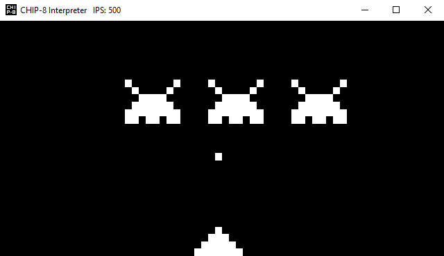
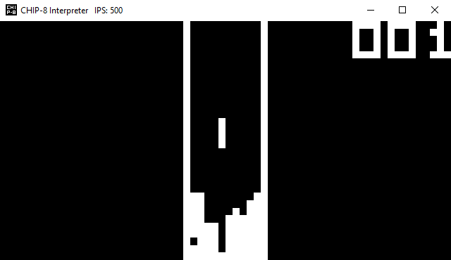

# CHIP-8 Interpreter

An interpreter for CHIP-8 programs.

The interface is made with WinAPI and GDI, thus only a Windows version.

The interpreter can be built to use either the original definitions of the CHIP-8 instructions, or the later, modified ones. Selected using macros in the "CHIP-8.h" file.

Provided as a Visual Studio 2019 solution.

 
<figure>
  <figcaption>Space Invaders by David Winter</figcaption>
  
</figure>

<figure>
  <figcaption>Tetris</figcaption>
  
</figure>
